<div class='body-title' align='center'>Abstract</div>
<p>
    Multimodal large language models (MLLMs) have shown impressive success across modalities such as image, video, and audio in a variety of understanding and generation tasks.we propose Web2Code, a benchmark consisting of a new large-scale webpage-to-code dataset for instruction tuning and an evaluation framework for the webpage understanding and HTML code translation abilities of MLLMs. For dataset construction, we leveraging pretrained LLMs to enhance existing webpage-to-code datasets as well as generate a diverse pool of new webpages rendered into images.To evaluate model performance in these tasks, we develop an evaluation framework for testing MLLMs' abilities in webpage understanding and web-to-code generation.Extensive experiments show that our proposed dataset is beneficial not only to our proposed tasks but also in the general visual domain, while previous datasets result in worse performance. We hope our work will contribute to the development of general MLLMs suitable for web-based content generation and task automation.
</p>


<div class='body-title' align='center'>Webpage Code Generation Data</div>
<p>
    Webpage code generation data contains two parts DWCG and DWCG<sub>R</sub>:  
</p>
<table>
    <tr>
        <td>
            DWCG Creation of new webpage image-code pair data: We generated high-quality HTML webpage-code pairs following the CodeAlpaca prompt using GPT-3.5 and convert them into instruction-following data.
        </td>
    </tr>
    <tr>
        <td>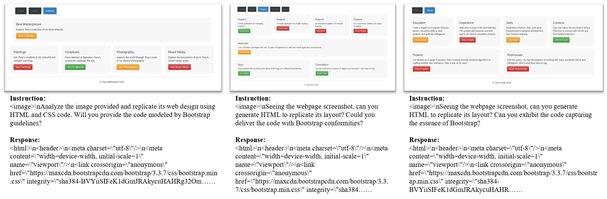</td>
    </tr>
    <tr>
        <td>
            DWCG<sub>R</sub> Refinement of existing webpage code generation data: We transform existing datasets including WebSight and Pix2Code into an instruction-following data format similar to LLaVA data.
        </td>
    </tr>
    <tr>
        <td>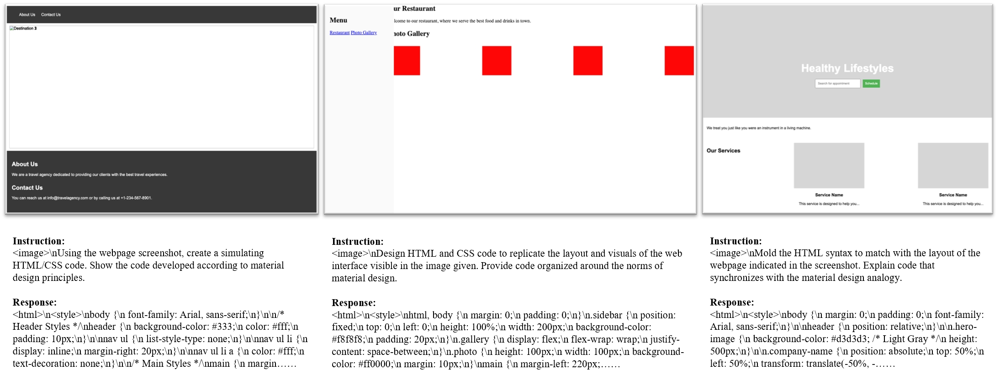</td>
    </tr>
</table>
<p>
    Comparison of dataset statistics among webpage code generation datasets: WebSight, Design2Code, Pix2Code, our DWCG, and our DWCG<sub>R</sub>.
</p>
<div style="text-align: center;">
    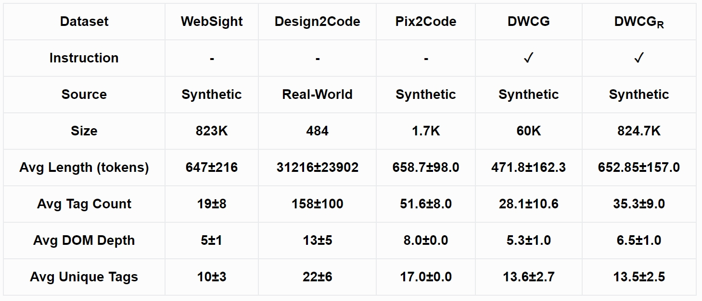
</div>
<p>
    The distribution the most common HTML tags in our GPT-3.5 generated HTML data.
</p>
<div style="text-align: center;">
    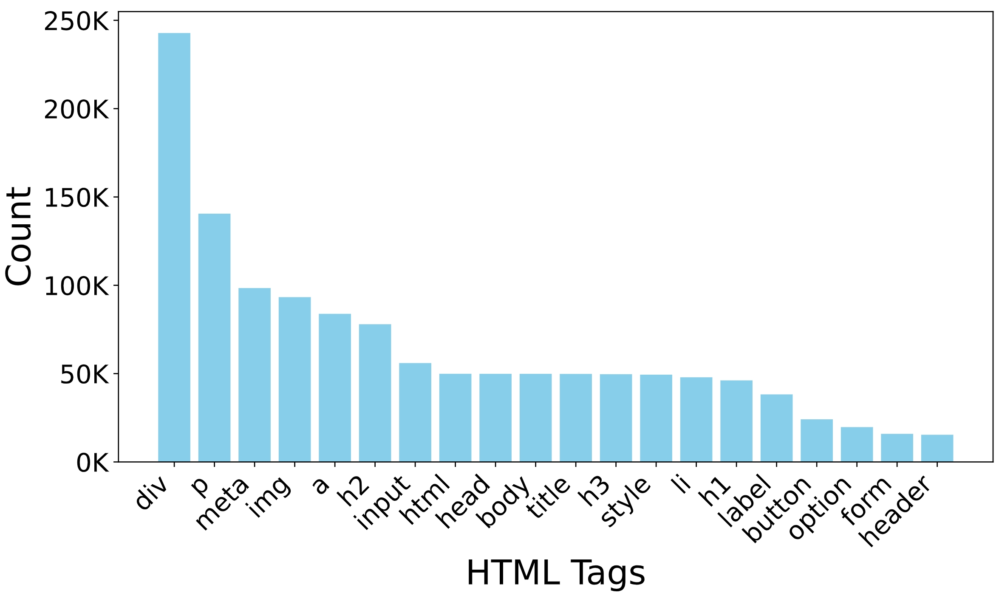
</div>


<div class='body-title' align='center'>Webpage Understanding Data</div>
<p>
    Webpage understanding data contains two parts DWU and DWU<sub>R</sub>:  
</p>
<table>
    <tr>
        <td>
            DWU Creation of a new text question-answer pair data: We generated a new question-answer pair dataset utilizing our new GPT-3.5 generated data from (1) in Webpage Code Generation Data for webpage understanding.
        </td>
    </tr>
    <tr>
        <td>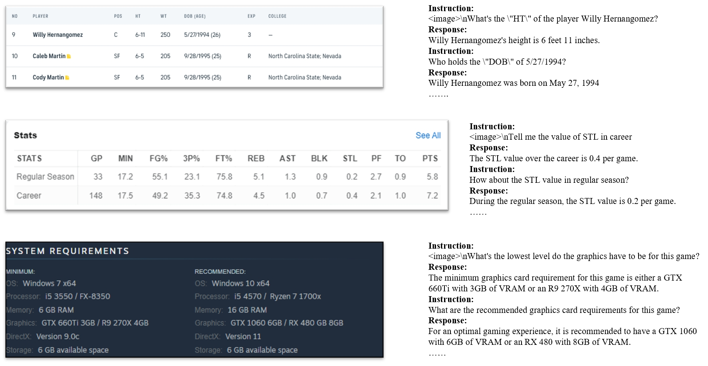</td>
    </tr>
    <tr>
        <td>
            DWU<sub>R</sub> Refinement of existing webpage understanding data: We refine the WebSRC question-answer data to improve its quality using the GPT-4.
        </td>
    </tr>
    <tr>
        <td>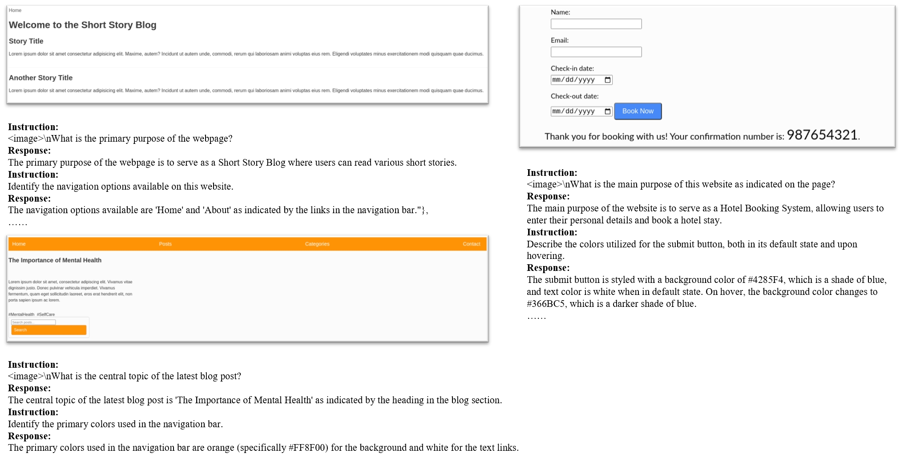</td>
    </tr>
</table>


<!-- <p>
    Distribution of DWU and DWUR datasets. Both datasets include high-quality question-answer pairs for webpage understanding.
</p>
<div style="text-align: center;">
    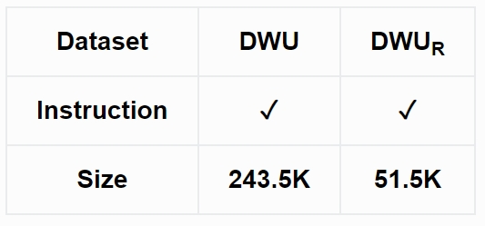
</div>
<p>
    Word Cloud for the answer set of the GPT4 based DWU dataset.
</p>
<div style="text-align: center;">
    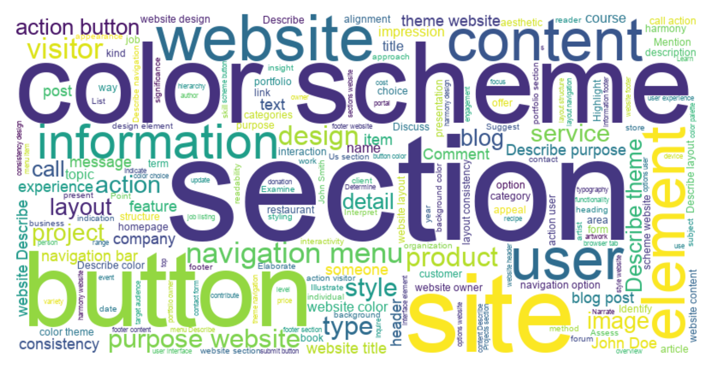
</div> -->

<div style="text-align: center;">
    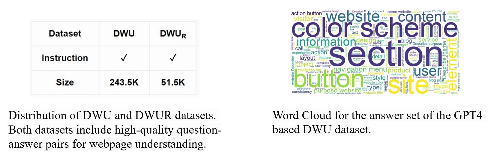
</div>


<style>
    table {
        font-family:Arial, sans-serif;
        font-size:14px;
        margin:auto;
    }
</style>
<!-- comparison
<table>
    <tr>
        <th>Dataset</th> <th>WebSight</th> <th>Design2Code</th> <th>Pix2Code</th> <th>DWCG</th> <th>DWCG<sub>R</sub></th>
    </tr>
    <tr>
        <th>Instruction</th> <th>-</th> <th>-</th> <th>-</th> <th>✓</th> <th>✓</th>
    </tr>
    <tr>
        <th>Source</th> <th>Synthetic</th> <th>Real-World</th> <th>Synthetic</th> <th>Synthetic</th> <th>Synthetic</th>
    </tr>
    <tr>
        <th>Size</th> <th>823K</th> <th>484</th> <th>1.7K</th> <th>60K</th> <th>824.7K</th>
    </tr>
    <tr>
        <th>Avg Length (tokens)</th> <th>647±216</th> <th>31216±23902</th> <th>658.7±98.0</th> <th>471.8±162.3</th> <th>652.85±157.0</th>
    </tr>
    <tr>
        <th>Avg Tag Count</th> <th>19±8</th> <th>158±100</th> <th>51.6±8.0</th> <th>28.1±10.6</th> <th>35.3±9.0</th>
    </tr>
    <tr>
        <th>Avg DOM Depth</th> <th>5±1</th> <th>13±5</th> <th>8.0±0.0</th> <th>5.3±1.0</th> <th>6.5±1.0</th>
    </tr>  
    <tr>
        <th>Avg Unique Tags</th> <th>10±3</th> <th>22±6</th> <th>17.0±0.0</th> <th>13.6±2.7</th> <th>13.5±2.5</th>
    </tr>
</table> -->


<!-- <table>
    <tr>
        <th>Dataset</th> <th>DWU</th> <th>DWU<sub>R</sub></th>
    </tr>
    <tr>
        <th>Instruction</th> <th>✓</th> <th>✓</th>
    </tr>
    <tr>
        <th>Size</th> <th>243.5K</th> <th>51.5K</th>
    </tr>
</table> -->

# Evaluation Framework

## Evaluation Metric for HTML Code Generation
<p>
    Our proposed evaluation framework includes two schemes: (1) Webpage Understanding Benchmark (WUB): An offline evaluation using ‘yes’/‘no’ questions. (2) Webpage Code Generation Benchmark (WCGB): An online evaluation (using GPT-4 Vision) based on image similarity.
</p>
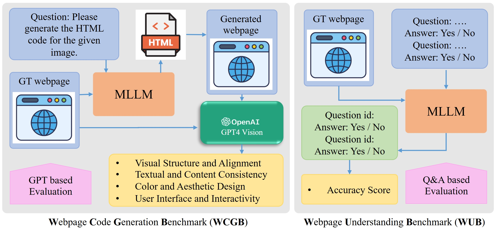

## Quantitative Evaluation for HTML Code Generation of MLLMs

<p>
    The accuracy of webpage understanding under various data configurations and LLM backbones. All models are instruction-tuned and evaluated on our WUB benchmark. We note that the general domain data (i.e., LLaVA) is included in all data configuration as default.
</p>
<!-- <table>
    <tr>
        <th>LLM Backbone</th> <th>DWCG</th> <th>DWU</th> <th>DWCGR</th> <th>DWUR</th> <th>Accuracy (%)</th>
    </tr>
    <tr>
        <th rowspan="2">CrystalCoder-7B</th> <th>✓</th> <th>-</th> <th>-</th> <th>-</th> <th>71.81</th>
    </tr>
    <tr>
        <th>✓</th> <th>✓</th> <th>-</th> <th>-</th> <th>73.74</th>
    </tr>
    <tr>
        <th rowspan="3">CrystalChat-7B</th> <th>-</th> <th>-</th> <th>-</th> <th>-</th> <th>73.94</th>
    </tr>
    <tr>
        <th>✓</th> <th>✓</th> <th>-</th> <th>-</th> <th>73.48</th>
    </tr>
    <tr>
        <th>✓</th> <th>✓</th> <th>✓</th> <th>✓</th> <th>74.14</th>
    </tr>
    <tr>
        <th>LLaMA3-8B</th> <th>✓</th> <th>✓</th> <th>✓</th> <th>✓</th> <th>74.84</th>
    </tr>
</table> -->
<div style="text-align: center;">
    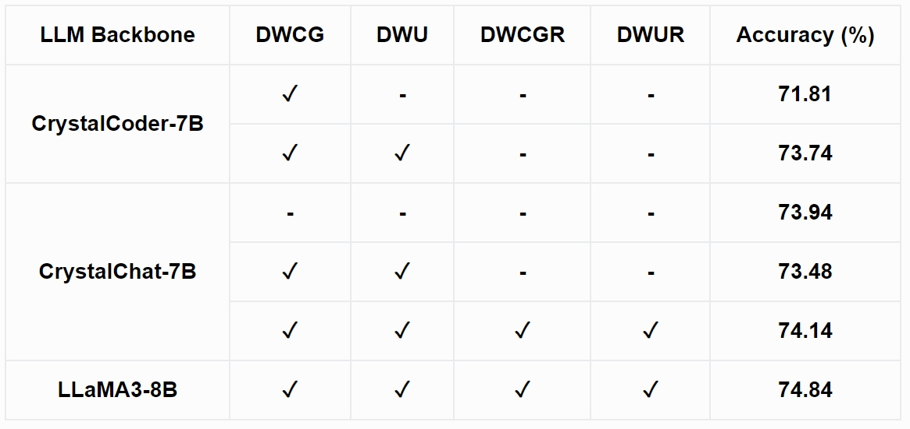
</div>
<p>
    The performance of different LLM backbones under various data configurations on our Webpage Code Generation Benchmark (WCGB). "VSA" denotes Visual Structure and Alignment, "CAD" represents Color and Aesthetic Design, "TCC" represents Textual and Content Consistency, and "UII" denotes User Interface and Interactivity
</p>
<!-- <table>
    <tr>
        <th>LLM Backbone</th> <th>DWCG</th> <th>DWU</th> <th>DWCGR</th> <th>DWUR</th> <th>VSA ↑</th> <th>CAD ↑</th> <th>TCC ↑</th> <th>UII ↑</th> <th>Overall ↑</th>
    </tr>
    <tr>
        <th rowspan="2">CystalCoder-7B</th> <th>✓</th> <th>-</th> <th>-</th> <th>-</th> <th>7.812</th> <th>7.899</th> <th>8.138</th> <th>8.112</th> <th>7.990</th>
    </tr>
    <tr>
        <th>✓</th> <th>✓</th> <th>-</th> <th>-</th> <th>8.010</th> <th>8.102</th> <th>8.266</th> <th>8.124</th> <th>8.126</th>
    </tr>
    <tr>
        <th rowspan="3">CrystalChat-7B</th> <th>-</th> <th>-</th> <th>-</th> <th>-</th> <th>4.714</th> <th>4.572</th> <th>4.865</th> <th>5.147</th> <th>4.825</th>
    </tr>
    <tr>
        <th>✓</th> <th>✓</th> <th>-</th> <th>-</th> <th>7.900</th> <th>8.001</th> <th>8.204</th> <th>8.215</th> <th>8.080</th>
    </tr>
    <tr>
        <th>✓</th> <th>✓</th> <th>✓</th> <th>✓</th> <th>8.384</th> <th>8.287</th> <th>8.417</th> <th>8.488</th> <th>8.394</th>
    </tr>
    <tr>
        <th>LLaMA3-8B</th> <th>✓</th> <th>✓</th> <th>✓</th> <th>✓</th> <th>8.522</th> <th>8.564</th> <th>8.421</th> <th>8.611</th> <th>8.530</th>
    </tr>
</table>
 -->
 <div style="text-align: center;">
    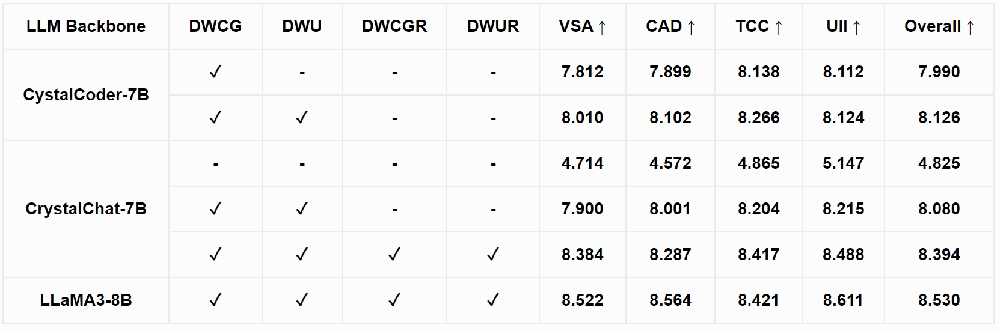
</div>

# Bibtext

```bib
Update Soon
```

# License

 **Usage and License Notices**: Usage and License Notices: The data is intended and licensed for research use only.  The dataset is CC BY 4.0 (allowing only non-commercial use) and models trained using the dataset should not be used outside of research purposes.
